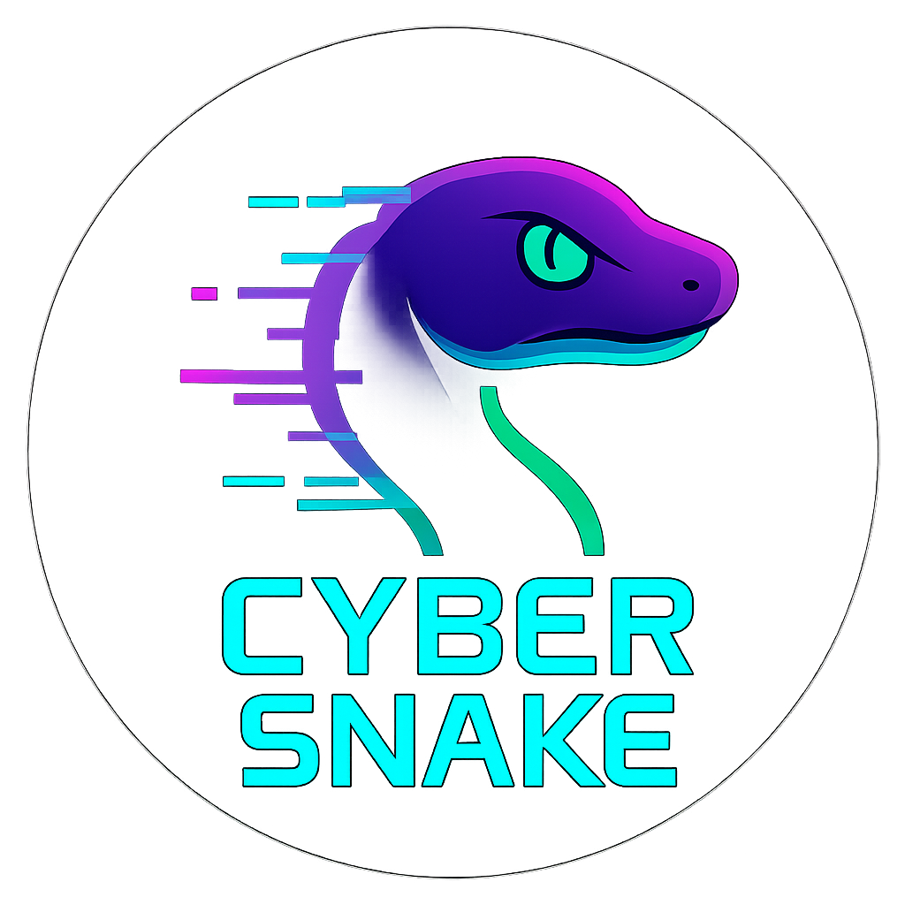

# 🐍 Cyber Snake

A futuristic reimagination of the classic Snake game — made with Unreal Engine 4.  
Built from scratch using **C++** for core gameplay and **Blueprints** for UI.

  

## 🎮 Gameplay

Collect neon data blocks to grow your snake.  
Reach the target length to win — but don't hit the walls or yourself, or it's Game Over.

YouTube project review video: https://youtu.be/bP7SWkohQ-A

---

## ✨ Key Features

- ⚙️ **Core gameplay fully implemented in C++**
- 🧩 **UI, menus, and flow handled via Blueprints (UMG)**
- 🕹️ Controls:
  - Gameplay: **keyboard**
  - Menus: **mouse-only navigation**
- 📺 Three UI screens:
  - **Main Menu**
  - **Game Over**
  - **Victory**
- 🎯 Win condition based on snake length
- 🧱 Death zones on all borders
- 🔊 Sound effects for eating, dying, and winning
- 💡 Cyberpunk-style visuals and glow effects

---

## 🧠 Learning Focus

This project was created as a learning exercise to practice:

- Writing **gameplay logic in C++** (UE4)
- Using **Blueprints (UMG)** for all UI/menus
- Creating and handling custom **GameMode** rules
- Managing **Actors** and snake segment Components via code
- Working with **UI transitions**, screen flow, and mouse input
- Editing materials with **emissive shaders** and post-processing

---

## 🚀 Getting Started

1. Clone the repo  
2. Open the `.uproject` file in **Unreal Engine 4.27**  
3. Press *Play* to start the game

---

